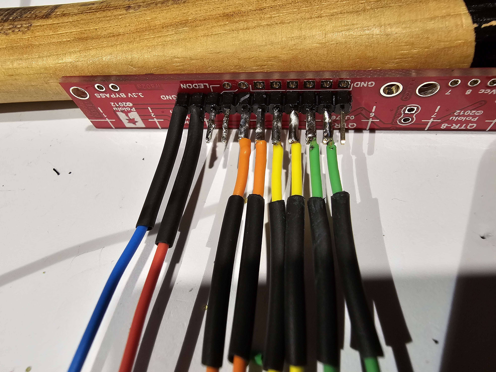

# Instructible

## Inhoudsopgave
1. [Bestellen van Componenten](#stap-1-bestellen-van-componenten)
2. [3D-printen](#stap-2-3d-printen)
3. [Tools en Overzicht](#stap-3-tools-en-overzicht)
4. [Elektrische Montage op PCB (Headers)](#stap-4-elektrische-montage-op-pcb-headers)
5. [Elektrische Montage op PCB (Weerstanden)](#stap-5-elektrische-montage-op-pcb-weerstanden)
6. [Elektrische Montage op PCB (LED’s)](#stap-6-elektrische-montage-op-pcb-leds)
7. [Montage Sensorhouder op het Chassis](#stap-7-montage-sensorhouder-op-het-chassis)
8. [Monteren PCB op het Chassis](#stap-8-monteren-pcb-op-het-chassis)
9. [Elektrische Montage QTR-8A](#stap-9-elektrische-montage-qtr-8a)
10. [Monteren QTR-8A op Chassis en Verbinding met PCB](#stap-10-monteren-qtr-8a-op-chassis-en-verbinding-met-pcb)
11. [Monteren van de Motoren](#stap-11-monteren-van-de-motoren)
12. [Monteren Batterijhouder en Spanningsverdeler](#stap-12-monteren-batterijhouder-en-spanningsverdeler)
13. [Installeren Visual Studio Code](#stap-13-installeren-visual-studio-code)
14. [Installeren Platform.io](#stap-14-installeren-platformio)
15. [Openen project](#stap-15-openen-project)
16. [Installeren driver voor ESP32](#stap-16-installeren-driver-voor-esp32)
17. [Parameters UserConfig.h](#stap-17-parameters-userconfigh)
18. [Uploaden naar ESP32](#stap-18-uploaden-naar-esp32)

---

## Stap 1: Bestellen van Componenten
In de [Bill of Materials](../bill%20of%20materials) (BOM) vindt u de benodigde componenten, die verkrijgbaar zijn bij de bijbehorende link. Als de link niet meer werkt, kunt u altijd ook een vervangende zoeken op Amazon of AliExpress. Het is handig om van elk onderdeel ten minste twee exemplaren te kopen, waardoor u bij eventuele defecten direct een vervangend exemplaar paraat heeft.

## Stap 2: 3D-printen
Er zijn diverse methoden beschikbaar om de onderdelen te 3D printen. Indien u in het bezit bent van een Ender-3 V2, kunt u eenvoudig de [.gcode](../technische%tekeningen/GCODE/) bestanden uploaden naar een SD-kaart en direct aan de slag gaan met printen (gebruikmakend van PLA, extruder ingesteld op 200°C en het printbed op 60°C). Wil je de printerinstellingen nakijken of aanpassen, dan kunt u de [.3mf](../technische%tekeningen/PrusaSlicer/) bestanden openen in PrusaSlicer. Voor degenen die de voorkeur geven aan andere software, is het ook mogelijk om de [.stl](../technische%tekeningen/STL/) bestanden te importeren. Als u wijzigingen wilt aanbrengen in het 3D-design, kunt u de originele [originele bestanden](../technische%tekeningen/mechanisch/Workingfolder-ELM3-Project-Synthese-LFR/) openen met Autodesk Inventor. Het is van belang om alles te downloaden binnen deze map, zodat Inventor alle benodigde referenties kan vinden.

## Stap 3: Tools en Overzicht
Zorg voor een workspace dat goed en gestructureerd is, dit voorkomt het verliezen van componenten. Voor tools hebt u het volgende nodig:
1. Toolbox met inbussleutels, dopsleutels en schroevendraaiers.
2. Een kniptang en striptang.
3. Breekmes, schuifmaat en dubbelzijdige plakband zijn ook handig.
4. Soldeerstation met de bijbehorende tin.

## Stap 4: Elektrische Montage op PCB (Headers)
Neem de volgende componenten erbij:
- PCB
- 1x 2-pin schroef terminal block
- 1x 4-pin schroef terminal block
- 1x 3-pin header female
- 2x 6-pin header female
- 1x 12-pin header female
- 2x 20-pin header female

We knippen van de 20 pin female headers 1 pin eraf zodat dit een 19 pin header wordt, deze past dan in de PCB. Vervolgens doen we hetzelfde voor de 12 pin female header, zodat deze een 11 pin header wordt. Soldeer nu de componenten aan de PCB zoals te zien op onderstaande foto.

## Stap 5: Elektrische Montage op PCB (Weerstanden)
Neem nu 9 weerstanden van 150Ω. Soldeer deze op de aangegeven locaties op het PCB, namelijk R3, R4, R5, R6, R7, R8, R10, R11 en R12. Voor R1, R2 en R9 hoeft geen weerstand te worden geplaatst; in plaats daarvan kan je restanten van andere gebruiken om de weerstanden te overbruggen. Dit komt doordat de blauwe en witte LED's, volgens de informatie op de website van de verkoper (TinyTronics), geen voorschakelweerstand nodig hebben. Als u andere LED's hebt gekocht, is het mogelijk dat ze wel een voorschakelweerstand nodig hebben, en in dat geval kunt u deze op die posities plaatsen.

## Stap 6: Elektrische Montage op PCB (LED’s)
Neem nu de volgende componenten erbij:
- 1x blauwe LED
- 1x groene LED
- 2x witte LED’s
- 3x rode LED’s
- Pushbutton
- ESP32-WROOM-32
- DRV8833

Soldeer de LED’s op de juiste plaats. Soldeer witte LED’s op LED_1 en LED_2. Voor LED_3, LED_4 en LED_12 soldeer je rode LED's. Op LED_5, LED_6, LED_7, LED_8 en LED_11 soldeer je oranje LED's. Op LED_10 komt een groene LED en ten slotte op LED_9 soldeer je een blauwe LED. Neem een pushbutton erbij en soldeer deze op de aangewezen plaats genaamd START1. Vervolgens nemen we de DRV8833 en solderen we de male headers met de korte pinnen aan de bovenkant zoals op de foto te zien is. Ten slotte plaatsen we de ESP-32 op de headers met de usb poort naar de achterkant, zoals het diagram op de PCB aantoont.

## Stap 7: Montage Sensorhouder op het Chassis
Neem het ge-3d-printe chassis en de ge-3d-printe sensorhouder. Deze worden verbonden met elkaar door middel van M3x16 en M3x10 bouten. Plaats de bouten zoals op de foto en bevestig de moeren. De twee achterste bouten bij de motor moeten M3x10 zijn, terwijl de drie voorste bouten bij de sensorhouder M3x16 moeten zijn.

## Stap 8: Monteren PCB op het Chassis
Neem het chassis en plaats de PCB over de 4 bouten die naar boven uitsteken. Neem dan 4 bouten en bevestig de PCB aan het chassis.

## Stap 9: Elektrische Montage QTR-8A
Neem de volgende componenten erbij:
- QTR-8A
- Krimpkous (⌀2,5)
- Kabels vaste kern (0,8mm²)

Neem de QTR-8A sensor en soldeer de mannelijke headers op de sensor volgens de afbeelding. Vervolgens gebruik je enkele kabels van ongeveer 6 cm. Soldeer deze kabels aan de mannelijke headers en schuif de krimpkous over de kabels, zoals te zien is op de foto. Verwarm ten slotte de krimpkous met een haardroger of lucifer.

## Stap 10: Monteren QTR-8A op Chassis en Verbinding met PCB
Bevestig de QTR-8A sensor aan het chassis volgens de afbeelding. Hiervoor zijn 3 M2,5x12 bouten en 3 M2,5 moeren nodig. Zodra de sensor is bevestigd, kunt u de draden aansluiten zoals aangegeven door de paden op de PCB. De GND bevindt zich helemaal links, terwijl de VCC helemaal rechts bij de bout zit. Als je niet zeker bent, kun je de traces op de PCB volgen om te zien waar ze naartoe leiden.

## Stap 11: Monteren van de Motoren
Neem de twee DC-motoren en voorzie ze elk van twee kabels: een rode voor de positieve zijde (+) en een blauwe voor de negatieve zijde (-). Plaats vervolgens de motoren met de kabels eerst in de houder. Bevestig da

## Stap 12: Monteren Batterijhouder en Spanningsverdeler
Neem de volgende componenten erbij:
- Batterijhouder
- 2x M3x10 bouten
- 2x M3 moeren
- 2x kabels vaste kern (0,8mm²)
- Krimpkous
- Spanningsverdeler (L7805CV)

Eerst gaan we de uiteinden van de batterijhouder voorzien van een draad met een vaste kern. Dit maakt het gemakkelijker om ze te verbinden met de schroefterminal van de PCB. Soldeer de rode draad van de batterijhouder aan een draad met een vaste kern en plaats er een stukje krimpkous over. Verwarm de krimpkous en herhaal dit proces voor de andere draad van de batterijhouder. Plaats vervolgens de draden in de juiste polariteit (bruin/rood naar VIN en zwart/blauw naar GND) in de schroefterminal. Bevestig de batterijhouder met M3-bouten en moeren zoals weergegeven in de foto. Ten slotte bevestigen we de spanningsverdeler (L7805CV) aan de PCB. Zorg ervoor dat de zijde met de heat spreader naar boven wijst, omdat de polariteit correct moet zijn. Bij twijfel kun je altijd de datasheet en het elektrisch schema raadplegen.

## Stap 13: Installeren Visual Studio Code
Om het correcte programma te uploaden naar onze ESP32 moeten we Visual Studio Code installeren. Dit kan heel simpel gedaan worden door een powershell terminal te openen en volgend commmando in te geven `winget install -e --id Microsoft.VisualStudioCode`

## Stap 14: Installeren Platform.io
Nu moeten we een IDE installeren in Visual Studio zodat we gemakkelijk kunnen uploaden. Dit doen we door naar extensions te gaan in visual studio code, dan te zoeken naar PlatformIO IDE en deze te installeren.

## Stap 15: Openen project
Om het project te openen in platform.io gaan we naar PIO Home -> Open -> Open Project. [Het project vind je hier (download de map Syntheseproject - Code)](../code/finaal/) 

## Stap 16: Installeren driver voor ESP32
Verbind nu de ESP32 met de computer, OPGELET, indien de batterijen van de robot al in de houder zitten dan moeten die UIT staan, als dit niet gedaan wordt zal je 8,4V op de USB poort terugsturen wat permanente schade kan toebrengen. De ESP32 zal nu nog niet herkend worden op de computer, eerst moeten we een driver installeren. [Deze driver (CP210x) je hier vinden.](../code/finaal/) Ga dan naar `apparaatbeheer` of `device manager` (te vinden in controlepaneel) op je computer. Bij `overige apparaten` of `other devices` zie je nu staan `CP2102 USB to UART Bridge Controller` met een warning sign. Rechtermuisklik op het apparaat en klik op update driver. Selecteer dan `Browse my computer for drivers` en ga naar de map waar je de CP210x driver hebt gedownload. Klik dan op next en dan op close wanneer alles geupdate is.

## Stap 17: Parameters UserConfig.h
Ga nu terug naar Visual Studio. In de explorer van visualstudio klap je nu `src` open, daarin staan twee bestanden, `main.cpp` en `UserConfig.h`. Open `UserConfig.h` en stel uw eigen parameters in. `ssid` is de netwerknaam van uw netwerk, `pswd` is het passwoord van uw netwerk en `host` is om gemakkelijk uw device terug te vinden op uw netwerk.

## Stap 18: Uploaden naar ESP32
Klik nu op upload dat je kan vinden in de balk linksonder, het ziet eruit als een pijltje. Wanneer dit succesvol gedaan is zie je in de terminal `SUCCES` in het groen verschijnen.

## Stap 19: Robot starten
Nu is alles klaar om de robot te starten. Verbreek de verbinding met de PC en haal de USB kabel eruit. Plaats de twee XTAR batterijen in de houder en zet de switch in de ON positie. Geef de stabiele waardes in die je kan vinden in de [manual.](../gebruiksaanwijzing/readme.md) Van hieruit kan je zelf spelen met de parameters. Veel succes!

